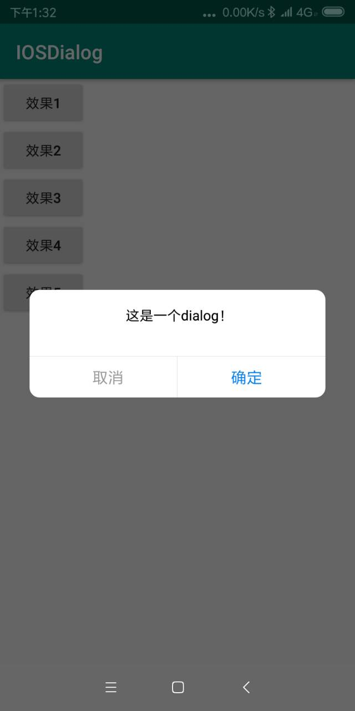

# IOSDialog

> ### 1.0  Gradle （版本号根据更新历史使用最新版）

    implementation 'com.github.quanquan521:IOSDialog:1.1'

> ### 效果图

  

> ### 使用

   var  dialog= CommonViewDialog(this)
        dialog.setTitle("提示")
        dialog.setMessage("这是一个dialog！")
        dialog.setNegtive("取消")
        dialog.setPositive("确定")
        dialog.show()
        val  listener=object :CommonViewDialog.OnClickBottomListener{
            override fun onPositiveClick() {
                dialog.dismiss() 
            }

            override fun onNegtiveClick() {
                dialog.dismiss()
            }
        }
        dialog.setOnClickBottomListener(listener)
